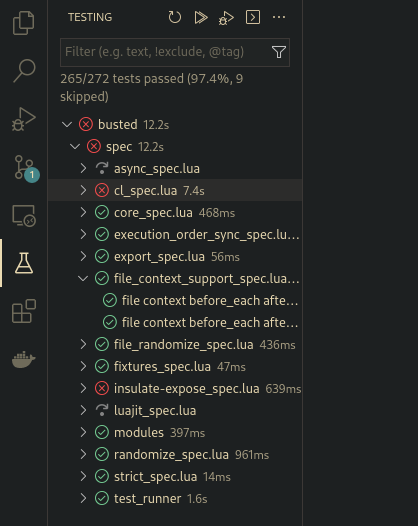

# Busted Tests

Run your busted test suite without leaving Visual Studio Code.

## Installation

Open 'Visual Studio Code' and type ctrl+P (⌘+P on Mac) to open the 'Command Palette', type 'ext install oroschz.busted-tests'.

## Requirements

This extension uses 'busted' for all of its functionaliy, and it asumes you have it installed on your machine and that it's also exposed on your PATH.

## Issues

Feel free to open an issue on GitHub if you have any bug reports or feature request. Feedback is always welcome.

## License

Busted Tests in licensed under the [MIT license](LICENSE)
